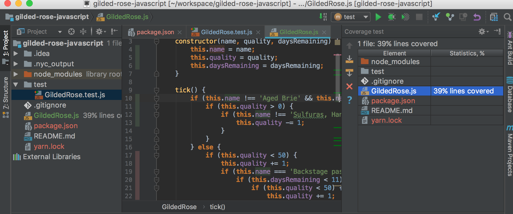

# Gilded Rose Kata

## Background

The Gilded Rose is a famous kata (or exercise) in OO, testing, and refactoring legacy code. By completing this kata, you will master the proper use of inheritance, by using it to eliminate conditionals in a wide-but-not-deep tree.

## Instructions

1. Watch [this video](https://www.youtube.com/watch?v=8bZh5LMaSmE) by Sandi Metz.
1. Fork & clone this repository
1. npm install
1. npm test (to insure tests run without problems before refactoring)
1. Refactor, following the example set by Ms. Metz
1. Verify the tests still pass
1. If time allows uncomment the "Conjured Item" tests and extend the solution to turn them green.

***Node: do not alter the 40 line if statement. Rewrite it then delete it like in the video.***

At 10:28 in the video, Ms. Metz talks about how to create "a seam". Follow this procedure to avoid having to understand the deeply nested conditionals.

### Run with Coverage

Use IntelliJ's run with coverage feature:

Observe the red lines of code and turn them green!

### Additional information

[Original Descripton of Gilded Rose](http://iamnotmyself.com/2011/02/13/refactor-this-the-gilded-rose-kata/)
